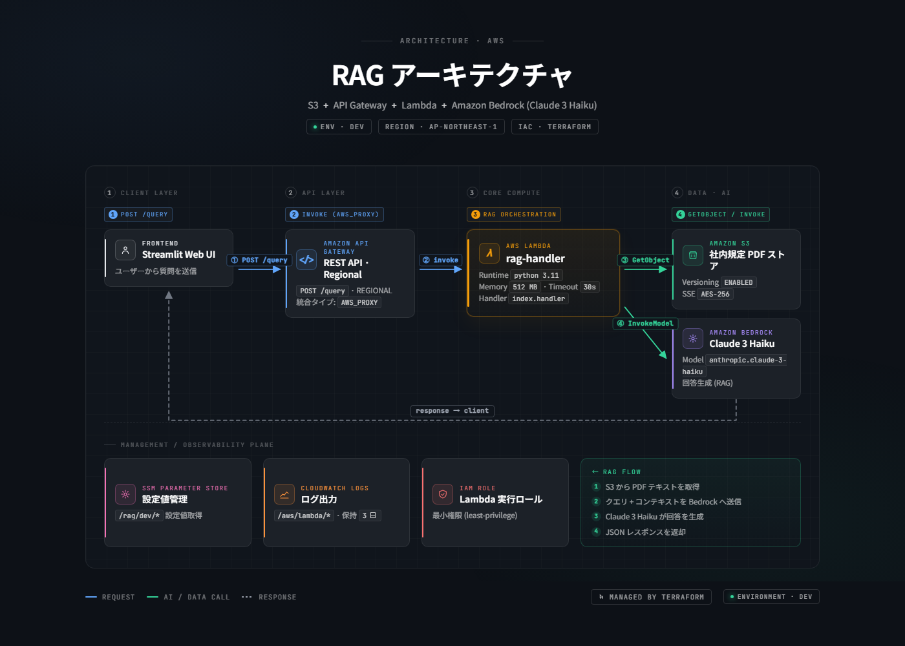
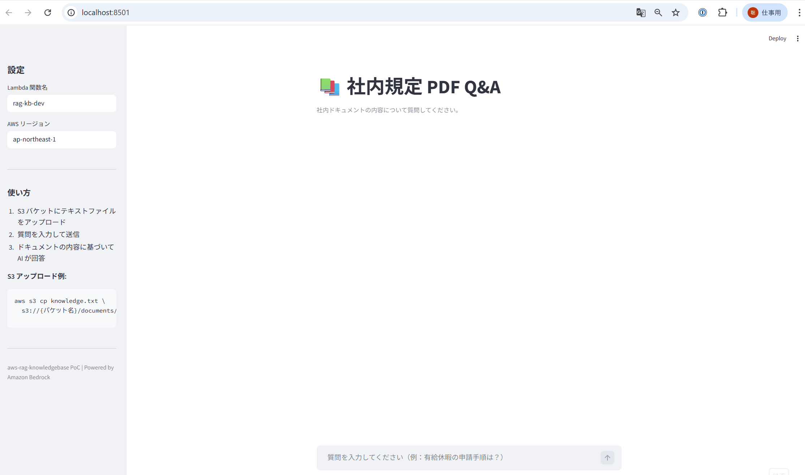
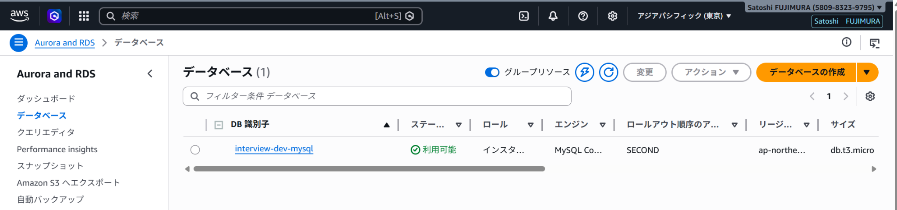
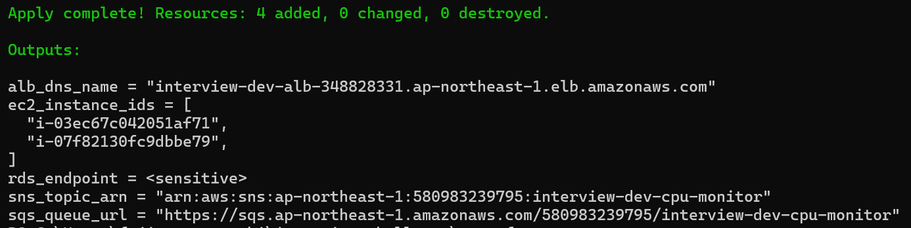
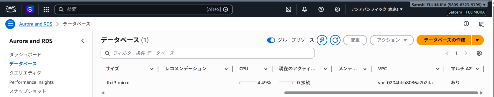

# aws-rag-knowledgebase


[](https://codecov.io/gh/satoshif1977/aws-rag-knowledgebase)


社内ドキュメント（テキスト）を S3 に格納し、Amazon Bedrock（Claude）で Q&A 回答を返す **RAG PoC** です。
Serverless 構成（Lambda + API Gateway）で、Streamlit の Web UI から手軽に試せます。

---

## アーキテクチャ



| # | 処理フロー |
|---|-----------|
| ① | Streamlit UI から Lambda を boto3 で直接 Invoke |
| ② | Lambda が S3 からドキュメントテキストを取得 |
| ③ | ドキュメント内容をコンテキストとして Bedrock（Claude 3 Haiku）に送信 |
| ④ | Bedrock が RAG 回答を生成して返却 |
| ⑤ | Streamlit が回答と参照元ソースをチャット形式で表示 |

---

## デモ

社内規定ドキュメントへの質問 → RAG 検索 → Bedrock 回答の流れ（質問3問）。



---

## 使用技術

| カテゴリ | 技術 |
|---------|------|
| AI モデル | Amazon Bedrock（Claude 3 Haiku） |
| バックエンド | AWS Lambda（Python 3.11） |
| API | Amazon API Gateway（REST API） |
| ストレージ | Amazon S3 |
| 監視 | Amazon CloudWatch Logs |
| Web UI | Streamlit + boto3 |
| IaC | Terraform |

---

## スクリーンショット

### Streamlit デモ画面（社内規定ドキュメント Q&A）



- 有給休暇・リモートワーク・経費申請について S3 ドキュメントから正確に回答
- `📂 S3 ドキュメント参照` ラベルでドキュメントベースの回答であることを明示

### Lambda 関数

| 関数概要 + API Gateway トリガー | コードソース・ランタイム |
|--------------------------------|------------------------|
|  |  |

### S3 バケット・ドキュメント

| バケット一覧 | knowledge.txt の詳細 |
|------------|---------------------|
|  |  |

### API Gateway


---

## ディレクトリ構成

```
aws-rag-knowledgebase/
├── app/
│   ├── app.py              # Streamlit Web UI
│   └── requirements.txt
├── docs/
│   ├── architecture.drawio
│   ├── architecture.drawio.png
│   └── screenshots/        # 動作確認スクリーンショット
├── lambda/
│   └── index.py            # RAG 処理（S3 取得 + Bedrock 呼び出し）
└── terraform/
    ├── main.tf             # S3 / Lambda / API Gateway / IAM / CloudWatch
    ├── variables.tf
    ├── outputs.tf
    └── terraform.tfvars.example
```

---

## セットアップ

### 前提

- AWS CLI / aws-vault 設定済み
- Terraform >= 1.5
- Amazon Bedrock で Claude 3 Haiku のモデルアクセスを有効化済み

### デプロイ手順

```bash
# 1. Terraform 変数ファイルを作成
cd terraform
cp terraform.tfvars.example terraform.tfvars
# terraform.tfvars を環境に合わせて編集

# 2. デプロイ
aws-vault exec <profile> -- terraform init
aws-vault exec <profile> -- terraform apply

# 3. S3 にドキュメントをアップロード
aws-vault exec <profile> -- aws s3 cp ../knowledge.txt \
  s3://<バケット名>/documents/knowledge.txt

# 4. Streamlit 起動
cd ../app
aws-vault exec <profile> -- streamlit run app.py
```

### Streamlit サイドバー設定

| 項目 | 説明 |
|------|------|
| Lambda 関数名 | Terraform output の `lambda_function_name` |
| AWS リージョン | `ap-northeast-1`（デフォルト） |

---

## 技術的なポイント・工夫

- **Serverless RAG 実装**: OpenSearch 等の Vector DB を使わず、S3 テキスト＋プロンプトエンジニアリングで RAG を実現（PoC に最適な軽量構成）
- **API Gateway vs Lambda Function URL**: SCP によるブロックがある企業アカウントでは API Gateway が安定
- **IAM 最小権限**: S3・Bedrock・SSM のみに絞ったインラインポリシー
- **Lambda Function URL との差別化**: 本プロジェクトは REST API として `/query` エンドポイントを公開（aws-bedrock-agent との設計比較が可能）
- **コスト感**: Lambda（呼び出し課金）+ API Gateway（呼び出し課金）+ S3（保存料）≒ ほぼ無料（PoC 規模）

---

## 関連リポジトリ

| リポジトリ | 概要 |
|-----------|------|
| [aws-bedrock-agent](https://github.com/satoshif1977/aws-bedrock-agent) | Slack Bot + Bedrock Agent（Function URL 使用） |
| [interview-challenge](https://github.com/satoshif1977/interview-challenge) | 3 層 Web アーキテクチャ（VPC / ALB / EC2 / RDS） |

---

*Managed by Terraform / Powered by Amazon Bedrock*

---

## CI / セキュリティスキャン

GitHub Actions で Python リント（flake8）と Terraform の静的解析（Checkov）を自動実行しています。

### 実施内容

| ジョブ | 内容 |
|---|---|
| Python lint（flake8） | コードスタイル・構文エラーの検出 |
| terraform fmt / validate | フォーマット・構文チェック |
| Checkov セキュリティスキャン | IaC のセキュリティポリシー違反を検出（soft_fail: false） |

### セキュリティ対応（Terraform で修正した内容）

| リソース | 追加設定 |
|---|---|
| S3（documents バケット） | SSE-AES256 暗号化・パブリックアクセスブロック（4項目）・バージョニング・ライフサイクル（90日削除 + multipart abort 7日） |
| Lambda | `tracing_config { mode = "PassThrough" }`（X-Ray 有効化） |
| IAM（Bedrock ポリシー） | `Resource = "*"` → 特定モデル ARN に限定 |
| CloudWatch Logs | 保持期間のデフォルトを 30 日に設定 |

### 意図的にスキップしている項目（PoC の合理的な省略）

| チェック ID | 内容 | 理由 |
|---|---|---|
| CKV_AWS_117 | Lambda VPC 内配置 | dev/PoC では不要 |
| CKV_AWS_272 | Lambda コード署名 | dev/PoC では不要 |
| CKV_AWS_116 | Lambda DLQ 設定 | dev/PoC では不要 |
| CKV_AWS_115 | Lambda 予約済み同時実行 | dev/PoC では不要 |
| CKV_AWS_173 | Lambda 環境変数 KMS | dev/PoC では不要 |
| CKV_AWS_158 | CloudWatch Logs KMS | dev/PoC では不要 |
| CKV_AWS_338 | CloudWatch Logs 保持期間 1 年未満 | dev は 30 日で十分 |
| CKV_AWS_145 | S3 KMS 暗号化 | AES256 で十分 |
| CKV_AWS_18 | S3 アクセスログ | dev/PoC では不要 |
| CKV_AWS_144 | S3 クロスリージョンレプリケーション | dev/PoC では不要 |
| CKV2_AWS_62 | S3 通知設定 | dev/PoC では不要 |
| API Gateway 系（複数） | 認証・WAF・アクセスログ・X-Ray・キャッシュ | dev/PoC では不要 |
| CKV_AWS_111 / CKV_AWS_356（インライン） | aws-marketplace Resource `"*"` | AWS がリソースレベル制限を非対応 |

---

## AI 活用について

本プロジェクトは以下の Anthropic ツールを活用して開発しています。

| ツール | 用途 |
|---|---|
| **Claude Code** | インフラ設計・コード生成・デバッグ・コードレビュー。コミットまで一貫してサポート |
| **Claude Cowork** | 技術調査・設計相談・ドキュメント作成を日常的に活用。AI との協働を業務フローに組み込んでいる |
| **カスタム Skills** | Terraform / Python / AWS に特化した Skills を設定・継続的に更新。自分の技術スタックに最適化したワークフローを構築 |

> AI を「使う」だけでなく、自分の業務・技術スタックに合わせて**設定・運用・改善し続ける**ことを意識しています。
